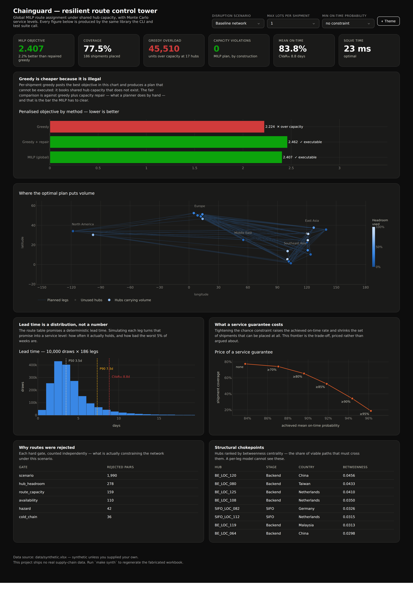
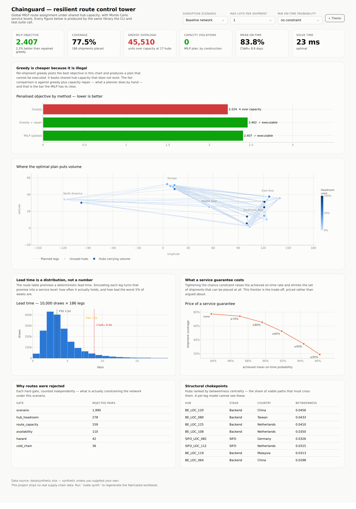

<h1 align="center">Chainguard</h1>

<p align="center">
  <strong>Global route optimisation for a semiconductor supply chain under disruption.</strong><br>
  MILP assignment under shared hub capacity · Monte Carlo service levels · multi-leg network analysis
</p>

<p align="center">
  <a href="#results">Results</a> ·
  <a href="#quickstart">Quickstart</a> ·
  <a href="docs/METHODOLOGY.md">Methodology</a> ·
  <a href="docs/DATA_SCHEMA.md">Data schema</a> ·
  <a href="#what-i-would-do-next">Limitations</a>
</p>

<p align="center">
  
  
  
  
  
</p>

---

## The problem, and the trap in it

Move semiconductor shipments across four stages — front-end → sort/inventory →
assembly & test → partner hand-off — choosing for each shipment one of ~3,800
candidate routes, minimising

```
0.40 × lead time  +  0.40 × cost per kg  +  0.20 × risk
```

under scenario-specific disruption, and do it for five stress tests: port
congestion, cold-chain restriction, primary hub down, air capacity reduced,
expedite priority.

The obvious solution — score every feasible route per shipment, take the best one
— is per-shipment optimal, fast, and **produces a plan that cannot be executed**.

> **Hub capacity is a shared resource, and per-shipment greedy treats it as
> private.** Every shipment independently picks the same handful of cheap, fast,
> low-risk hubs. Nothing in the loop notices that their combined volume has blown
> through those hubs' weekly headroom.

Measured across all seven scenarios on the bundled synthetic network, greedy
over-books **100 hub-scenario pairs by 242,120 units**. **Zero of its seven plans
are executable.** It posts the best objective in the table by spending capacity
that does not exist.

This project is about closing that gap, and about the three follow-on questions
that turn a scoring script into a decision tool: *how many shipments can we
actually place*, *how often will this plan hold*, and *what does a service
guarantee cost*.

---

## Results

Every number below is produced by `make benchmark` and read from
[`artifacts/benchmark.csv`](artifacts/). Nothing here is typed by hand. Seven
scenarios, synthetic data, seed 42, ~28s end to end.

### Headline

Means across the seven scenarios:

| | Greedy | Greedy + repair | **MILP** | MILP + split-3 | MILP + 85% SLA |
|---|---|---|---|---|---|
| Executable plans | **0 / 7** | 7 / 7 | **7 / 7** | 7 / 7 | 7 / 7 |
| Capacity violations | 100 | 0 | **0** | 0 | 0 |
| Units over capacity | 242,120 | 0 | **0** | 0 | 0 |
| Penalised objective ↓ | *2.311* † | 2.526 | **2.475** | **1.092** | 4.542 |
| Coverage ↑ | 78.3% † | 76.3% | 76.8% | **91.2%** | 55.2% |
| Mean on-time ↑ | 84.6% † | 83.9% | 84.1% | 84.8% | **91.8%** |
| Proven optimal | — | — | **7 / 7** | 7 / 7 | 7 / 7 |
| Mean solve time | 0 ms | 0 ms | **11 ms** | 9.1 s | 6 ms |

† Greedy's figures describe a plan that cannot be run. They are in the table to
show the size of the illusion, not as a competitive result.

**The three findings:**

1. **Against a fair, executable baseline the MILP wins — and proves it.** Versus
   greedy-plus-capacity-repair (what a planner does by hand), the MILP improves
   the penalised objective by **2.02%** while returning a **provably optimal**
   solution on all seven scenarios in **11 ms** mean solve time.
2. **Split-shipment relaxation is where the real gain is.** Allowing a shipment's
   quantity across up to 3 lots lifts coverage **76.8% → 91.2%** and cuts the
   penalised objective **55.9%**, still with zero capacity violations. The
   binding constraint was never route quality — it was large quantities meeting
   small residual headroom.
3. **A service guarantee has a price, and it is steep.** A chance constraint at
   85% on-time raises achieved service **84.1% → 91.8%**, and costs **21.6
   percentage points of coverage.** That trade-off is a decision for a human; the
   model's job is to price it, not to hide it.

<details>
<summary><b>Full per-scenario results</b></summary>

Penalised objective (lower is better), all seven scenarios:

| Scenario | greedy † | greedy_repair | milp | milp_split3 | milp_sla85 |
|---|---|---|---|---|---|
| Baseline | 2.224 | 2.462 | 2.407 | **1.140** | 4.793 |
| Port congestion | 2.089 | 2.360 | 2.276 | **0.956** | 3.386 |
| Cold-chain restriction | 2.674 | 2.883 | 2.883 | **1.256** | 6.067 |
| Primary hub down | 2.340 | 2.610 | 2.531 | **1.088** | 4.072 |
| Air capacity reduced | 2.588 | 2.723 | 2.652 | **1.079** | 4.120 |
| Expedite priority | 1.997 | 2.190 | 2.134 | **0.986** | 4.552 |
| Sustainability | 2.265 | 2.455 | 2.444 | **1.137** | 4.805 |

Coverage:

| Scenario | milp | milp_split2 | milp_split3 |
|---|---|---|---|
| Baseline | 77.5% | 85.8% | **90.8%** |
| Port congestion | 78.8% | 85.8% | **92.5%** |
| Cold-chain restriction | 72.9% | 87.5% | **89.6%** |
| Primary hub down | 76.2% | 83.3% | **91.2%** |
| Air capacity reduced | 75.0% | 85.4% | **91.2%** |
| Expedite priority | 79.5% | 86.8% | **91.6%** |
| Sustainability | 77.5% | 86.2% | **91.2%** |

Regenerate with `make benchmark`; the full table including CVaR, CO₂, cost and
solver status is written to `artifacts/benchmark.csv`.

</details>

### Control tower

`make app` — every figure is computed by the same library the CLI and tests call,
so the screen and the benchmark cannot disagree.

<p align="center">
  
</p>

<details>
<summary>Light mode</summary>
<p align="center">
  
</p>
</details>

---

## Quickstart

No data required — the repo generates its own.

```bash
git clone https://github.com/richelsalim/chainguard && cd chainguard
python -m pip install -e ".[all]"

make synth        # fabricate a runnable dataset (nothing real, ever)
make optimize     # solve one scenario, compare greedy / repair / MILP
make benchmark    # full head-to-head across 7 scenarios -> artifacts/
make app          # control tower at http://127.0.0.1:8050
make test         # 93 tests
```

<details>
<summary><b>CLI reference</b></summary>

```bash
chainguard synth      --out data/synthetic.xlsx --seed 42
chainguard profile    --data data/your_workbook.xlsx      # validate against the schema
chainguard optimize   --scenario port_congestion --max-splits 3 --min-otd 0.85
chainguard simulate   --scenario cold_chain --draws 50000
chainguard network    --scenario primary_hub_down --top 10
chainguard benchmark  --scenarios baseline port_congestion --splits 2 3 --sla 0.85 0.90
```

Scenarios: `baseline`, `port_congestion`, `cold_chain`, `primary_hub_down`,
`air_capacity_reduced`, `expedite_priority`, `sustainability`.

</details>

---

## How it works

```
                 data/*.xlsx  (yours, or fabricated by `make synth`)
                       │
   loader.py ──────────┤  typed frames, schema contract enforced at the boundary
                       ▼
   feasibility.py ─────┤  10 hard gates + a ledger of what each one rejected
                       ▼
   scoring.py ─────────┤  40/40/20, min-max normalised per shipment
                       ▼
        ┌──────────────┼──────────────┬─────────────────┐
        ▼              ▼              ▼                 ▼
  optimize/greedy  optimize/repair  optimize/milp    network.py
  per-shipment     min-regret       CP-SAT global    NetworkX graph
  argmin           capacity repair  assignment       paths + centrality
  (the trap)       (fair baseline)  (+ splits, SLA)
        └──────────────┴──────────────┴─────────────────┘
                       ▼
   simulate.py ────────┤  Gamma + disruption shocks -> P90, on-time, CVaR₉₅
                       ▼
   benchmark.py ───────┴─→ artifacts/  ·  cli.py  ·  app/dashboard.py
```

### The MILP, briefly

Binary $x_{ij\ell}$ places lot $\ell$ of shipment $i$ on route $j$; $z_{i\ell}$
drops it at penalty $M$.

$$
\min \sum_{i,j,\ell} \tfrac{s_{ij}}{L}\,x_{ij\ell} + \tfrac{M}{L}\sum_{i,\ell} z_{i\ell}
\quad\text{s.t.}\quad
\underbrace{\sum_{(i,j,\ell)\,:\,h \in \{o_j,d_j\}} q_{i\ell}\,x_{ij\ell} \le K_h}_{\textbf{shared hub headroom}}
$$

That hub constraint is the whole difference. **Remove it and the program
decomposes into $|S|$ independent argmins — it *becomes* greedy.** That claim is a
test, not a boast:
[`test_milp_without_capacity_reproduces_greedy`](tests/test_optimize.py) runs the
MILP with capacity coupling disabled and asserts the objective matches greedy's
to 1e-3.

Full formulation, the cost-per-kg derivation, the capacity model and two
corrected bugs: **[docs/METHODOLOGY.md](docs/METHODOLOGY.md)**.

---

## A negative result I kept

The intuitive way to make a plan risk-aware is to swap the deterministic lead-time
term for simulated CVaR₉₅ and call it done. **It does not work**, and finding out
why was the most useful thing the simulation layer produced.

Both terms are min-max normalised inside each shipment's candidate pool, and CVaR
compresses differently from mean lead time at the low end. A route that is
second-best on lead time can sit *relatively* closer to the front on normalised
CVaR — and the 40% cost term then tips the decision toward it. Some choices flip
to routes with a **worse** tail.

Measured: **~8% of routing decisions flip, and mean CVaR₉₅ moves the wrong way by
0.27 days.**

So the service target does not belong in the objective, where a cost term can
outvote it. It belongs in the **feasible region**, where it holds by construction
and its price is measurable. That is the chance constraint — `--min-otd 0.85` —
which raises achieved on-time from 84.1% to 91.8% and reports exactly what it
costs.

The result is reproducible (`chainguard simulate`), documented on the function
that produces it, and deliberately not deleted.

---

## Data privacy

**This repository contains no real supply-chain data, and CI enforces that.**

The dataset behind the original challenge belongs to its organiser. It is not
redistributed here in any form. Instead:

- `make synth` fabricates a workbook with the same five-sheet schema and
  comparable distributions. Every hub, material, forwarder, lot and shipment ID
  is generated from a seeded RNG. City names and coordinates are real, publicly
  known logistics locations chosen so the map is legible.
- `.gitignore` blocks `.env`, every spreadsheet extension, and everything under
  `data/`.
- A [CI job](.github/workflows/ci.yml) fails the build if a `.env`, a spreadsheet,
  or anything matching an API-key pattern is ever committed.

The generator is **constructive about feasibility**: for every shipment it emits,
it guarantees at least one route clearing every hard gate. That makes the
synthetic workbook a valid regression fixture — an infeasibility reported on it is
a bug in the optimiser, not a gap in the data.

Bringing your own workbook: [docs/DATA_SCHEMA.md](docs/DATA_SCHEMA.md).

---

## Testing

```
93 tests · ruff clean · CI on Python 3.10 / 3.11 / 3.12
```

The suite asserts the claims this README makes rather than just exercising code
paths:

| Test | Guards |
|---|---|
| `test_milp_respects_every_hub_capacity` | the optimal plan is executable |
| `test_milp_without_capacity_reproduces_greedy` | the gain comes from the coupling constraint, nothing else |
| `test_milp_beats_repair_on_the_penalised_objective` | the headline claim |
| `test_headroom_is_linear_in_the_utilisation_ceiling` | regression on a real capacity bug |
| `test_cold_chain_candidates_only_use_cold_capable_hubs` | the safety-critical gate |
| `test_cvar_dominates_the_percentile_it_is_taken_from` | CVaR₉₅ ≥ P95, analytically |
| `test_disruptions_shift_the_mean_upward_by_the_expected_amount` | the shock term matches `P × E[Exp(λ)]` |
| `test_compounded_path_risk_exceeds_any_single_leg` | multi-leg risk compounds, not averages |
| `test_split_relaxation_never_reduces_coverage` | the relaxation is monotone |

Tests run against a small synthetic workbook generated at collection time, so
they need no data files, finish in seconds, and exercise the real loader and the
real Excel round-trip.

---

## What I would do next

Stated because a model whose limits are undocumented is a model whose limits are
unknown. Full list in [METHODOLOGY §7](docs/METHODOLOGY.md#7-known-limitations).

1. **Correlated disruptions.** Simulated legs are independent; real ones are not —
   one typhoon delays every leg through a region. A shared regional shock factor
   or a copula would fatten the joint tail the current model flattens.
2. **Fit the risk model instead of assuming it.** The `RiskScore → CV` mapping is
   a plausible linear form with documented constants, not an estimate. The
   internal sheet carries `TransitDelayDays`; fitting against realised delays is
   the highest-value next step and would make the service levels defensible rather
   than merely coherent.
3. **Time-phased capacity.** Hub headroom is one weekly number. A plan feasible
   for the week can be infeasible on Tuesday.
4. **Continuous split volumes.** Lots are balanced; sizing them to the capacity
   actually available would dominate, at the cost of a harder integer program.

---

## Background

Built for the **Infineon Supply Chain Challenge 2026**, where an earlier version
of this work reached the finals. This repository is a substantial rebuild of that
prototype: the global MILP, the split-shipment relaxation, the chance constraint,
the Monte Carlo layer, the network graph and the test suite are all new, and the
scoring engine was reimplemented from scratch against the published objective.

Not affiliated with or endorsed by Infineon Technologies AG. No challenge data is
included.

## License

MIT — see [LICENSE](LICENSE).
